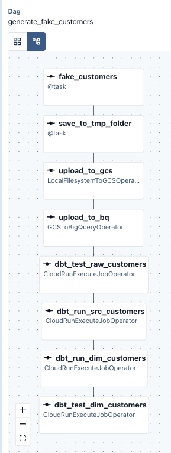
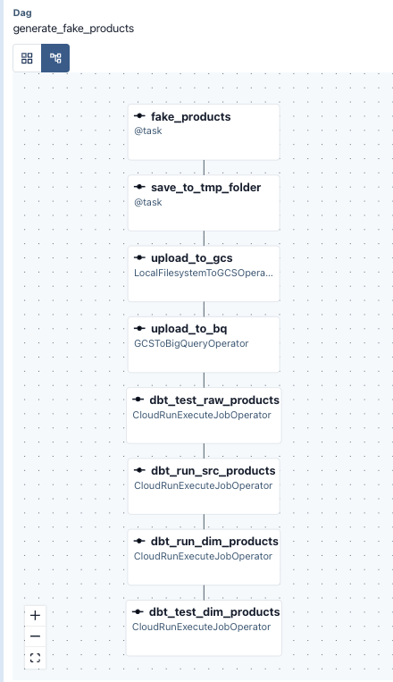
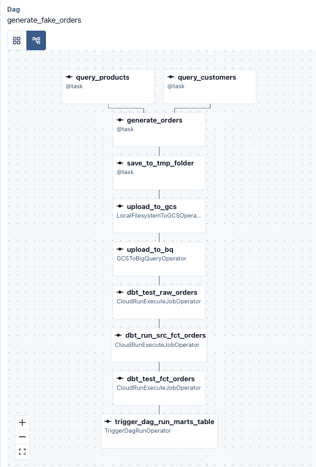

# Airflow + dbt Faker E-commerce Pipeline

A containerized, GCP-native data pipeline that generates synthetic e-commerce data (customers, products, orders) and transforms it into analytics-ready tables using **Apache Airflow 3** for orchestration and **dbt (BigQuery)** for transformation. Both components run as Docker containers, with dbt itself deployed as a **Cloud Run Job** that Airflow invokes remotely.

**dbt docs:** https://candychen00.github.io/faker-ecom-project__dbt/

<br>
<br>

## Tech stack

- **Orchestration:** Apache Airflow 3.3.1 (LocalExecutor)
- **Transformation:** `dbt-bigquery`
- **Compute:** Docker Compose (for Airflow) , Cloud Run Jobs (for dbt)
- **Warehouse/Storage:** BigQuery, Google Cloud Storage
- **CI/CD:** GitHub Actions → Google Artifact Registry → Google Cloud Run Jobs → GitHub Pages (deploy dbt docs)
- **Data generation:** [Faker](https://faker.readthedocs.io/)
- **Tests:** `dbt_utils`, `dbt_expectations`

<br>
<br>

## Architecture

```
   ┌────────────────────────────────────────┐
   │  Airflow (Docker) DAGs generate        │ 
   │  fake customers / products / orders    │
   └───────────┬────────────────────────────┘
               │  upload CSV
               ▼
   ┌──────────────────────────┐
   │  Google Cloud Storage    │
   └───────────┬──────────────┘
               │  load
               ▼
   ┌─────────────────────────┐
   │  BigQuery (raw tables)  │
   └───────────┬─────────────┘
               │  trigger via CloudRunExecuteJobOperator
               ▼
   ┌───────────────────────────────────────────────┐
   │  dbt runs on Cloud Run Job                    │
   │  (src tables → dim/fct tables → mart tables)  │
   └───────────────────────────────────────────────┘
```

<br>

The Airflow container doesn't install dbt packages directly. Instead, each DAG loads raw data, then invokes a `dbt` Cloud Run Job (via airflow's `CloudRunExecuteJobOperator`) with a specific `dbt run`/`dbt test --select` command in airflow tasks. 

This pattern chains the customers, products, and orders DAGs into a single end-to-end process: raw load → source tests → staging/dim/fct build → tests → downstream DAG trigger.


 - Airflow DAG graph #1 - `generate_fake_customers`

   


 - Airflow DAG graph #2 - `generate_fake_products`

   


 - Airflow DAG graph #3 - `generate_fake_orders`

   

<br>
<br>

## Repository layout

```
.
├── airflow/                  # Airflow project (Docker image + DAGs)
│   ├── Dockerfile 
│   ├── docker-compose.yaml    # Local Airflow cluster (LocalExecutor + Postgres)
│   ├── dags/
│   │   ├── generate_fake_customers.py   # Faker customers -> GCS -> BQ raw -> dbt src/dim
│   │   ├── generate_fake_products.py    # Faker products  -> GCS -> BQ raw -> dbt src/dim
│   │   ├── generate_fake_orders.py      # Random orders   -> GCS -> BQ raw -> dbt src/fct -> trigger marts dag
│   │   └── run_mart_tables.py           # Builds mart tables
│   ├── requirements.txt
│   └── secret/gcp-key.json 
│
├── dbt/                       # dbt project (Docker image, deployed to Cloud Run)
│   ├── Dockerfile              # python:3.12-slim + dbt-bigquery
│   ├── secret/gcp-key.json
│   └── my_dbt_project/
│       ├── dbt_project.yml     # materializations: src=ephemeral, dim/fct/mart=table
│       ├── profiles.yml 
│       ├── packages.yml        # dbt_utils, dbt_expectations
│       └── models/
│           ├── sources.yml     # raw_customers / raw_products / raw_orders + source tests
│           ├── schemas.yml     # models tests
│           ├── src/            # src_customers, src_products, src_orders (ephemeral)
│           ├── dim/             # dim_customers, dim_products
│           ├── fct/             # fct_orders (incremental, merge on order_id)
│           └── mart/            # daily_sales, monthly_sales (rolling aggregates)
│
├── .github/workflows/deploy.yml   # CI/CD: build & push dbt image, deploy Cloud Run Job, publish dbt docs
└── readme-folder/                 # Images used in this README
```

<br>
<br>

## Data pipeline

1. **Generate & land raw data** — `generate_fake_customers` and `generate_fake_products` use [Faker](https://faker.readthedocs.io/) to create synthetic records, write them to a temp CSV, upload to GCS (`candy-faker-ecom-data`), then load into BigQuery (`airflow_dbt_faker_ecom_raw`) via `GCSToBigQueryOperator`.
2. **Generate orders** — `generate_orders_v3` samples existing customers/products from BigQuery, fabricates random orders, and follows the same GCS → BigQuery raw load path.
3. **Transform with dbt (on Cloud Run)** — after each raw load, the DAG calls the `mydbt2` Cloud Run Job with `dbt test`/`dbt run --select ...` to:
   - test the new source data,
   - build the relevant `src_*` (ephemeral) and `dim_*` / `fct_orders` models,
   - run tests on those models.
4. **Build marts** — `generate_ofake_orders` dag triggers `run_mart_tables` dag, which runs and tests everything under `models/mart` (`daily_sales`, `monthly_sales`).

<br>

### dbt model layers

| Layer  | Materialization | Models | Purpose |
|--------|------------------|--------|---------|
| `src`  | ephemeral | `src_customers`, `src_products`, `src_orders` | Light cleaning/renaming directly on raw sources |
| `dim`  | table | `dim_customers`, `dim_products` | Cleaned dimension tables |
| `fct`  | table (incremental, merge on `order_id`) | `fct_orders` | Orders joined with dims, with computed `order_amount` |
| `mart` | table | `daily_sales`, `monthly_sales` | Sales aggregated by date/month, product category,  fruit |

<br>

### Data quality

- Source and model tests are defined in `models/sources.yml` / `models/schema.yml` using core dbt tests (`not_null`, `unique`, `relationships`) plus [`dbt_expectations`](https://github.com/metaplane/dbt-expectations) (e.g. `expect_column_values_to_be_between`, `accepted_values`).
- Tests run automatically as part of each DAG before dependent models are built.

<br>
<br>

## CI/CD

`.github/workflows/deploy.yml` runs on every push to `main`:

1. Builds the `dbt/` Docker image and pushes it to **Google Artifact Registry**.
2. Deploys the new image to the **Cloud Run Job** (`mydbt2`) that Airflow invokes.
3. Runs `dbt test` against BigQuery to validate the project.
4. Generates `dbt docs` and publishes them to **GitHub Pages**.

<br>
<br>

